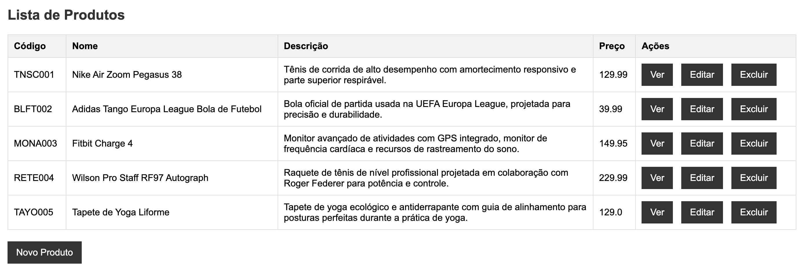
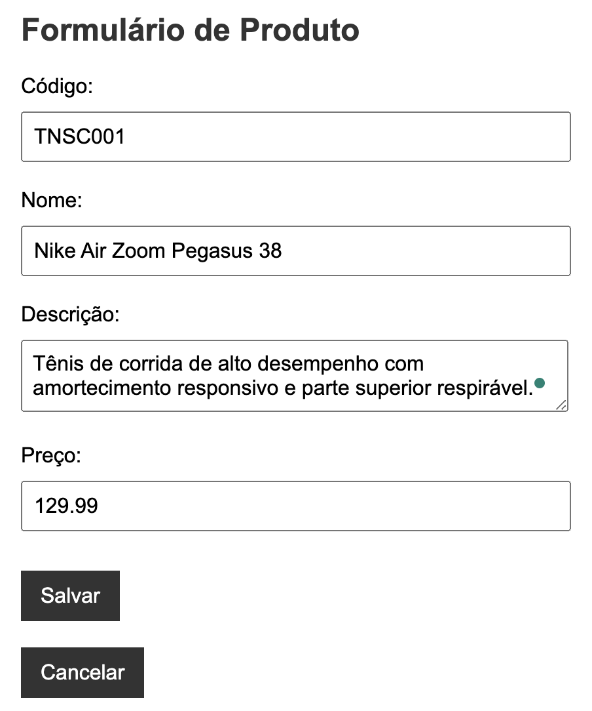

# Nunes Sports System

The Nunes Sports Product Management System is a web application for managing products in the fictitious Nunes Sports 
company. It provides functionalities for creating, updating, and deleting products, as well as viewing a list of the
registered products.

## Features

- CRUD (Create, Read, Update, Delete) operations for products.
- Web interface for managing products.

## Screenshots

List of registered products, with buttons to view, edit and delete them, as well as a button to add a new product.




Form for adding a new product or editing a registered product.




## Getting Started

### Prerequisites

Make sure you have the following installed on your system:

- Java
- Maven
- PostgreSQL

### Installation

1. Clone the repository:

   ```bash
   git clone https://github.com/rewenila/products-crud.git
   ```
   
2. Navigate to the project directory:

    ```bash
    cd products-crud
    ```

4. Build the project using Maven:

    ```bash
    mvn clean install
    ```
   
5. Run the Spring Boot application:

    ```bash
    mvn spring-boot:run
    ```

The application should be running at http://localhost:8080.

## Usage

Access the web interface at http://localhost:8080/products.
Use the CRUD operations to manage products.

## Technologies

- Java
- Spring Boot
- Thymeleaf
- PostgreSQL
- Maven

## License

This project is licensed under the [MIT License](https://choosealicense.com/licenses/mit/).

---

# Sistema Nunes Sports

O Sistema de Gerenciamento de Produtos da Nunes Sports é uma aplicação web para gerenciar produtos na fictícia empresa Nunes Sports. Ele oferece funcionalidades para criar, atualizar e excluir produtos, além de visualizar uma lista dos produtos registrados.

## Recursos

- Operações CRUD (Criar, Ler, Atualizar, Excluir) para produtos.
- Interface web para gerenciar produtos.

## Capturas de Tela

Lista de produtos registrados, com botões para visualizar, editar e excluir, além de um botão para adicionar um novo produto.


Formulário para adicionar um novo produto ou editar um produto registrado.


## Começando

### Pré-requisitos

Certifique-se de ter os seguintes itens instalados no seu sistema:

- Java
- Maven
- PostgreSQL

### Instalação
1. Clone o repositório:

   ```bash
   git clone https://github.com/rewenila/products-crud.git
   ```

2. Navegue até o diretório do projeto:

   ```bash
   cd products-crud
   ```

3. Compile o projeto usando o Maven:

   ```bash
   mvn clean install
   ```

4. Execute a aplicação Spring Boot:

   ```bash
   mvn spring-boot:run
   ```

A aplicação deverá estar rodando em http://localhost:8080.

## Uso

Acesse a interface web em http://localhost:8080/products.
Utilize as operações CRUD para gerenciar produtos.

## Tecnologias
- Java
- Spring Boot
- Thymeleaf
- PostgreSQL
- Maven

## Licença
Este projeto está licenciado sob a [Licença MIT](https://choosealicense.com/licenses/mit/).


